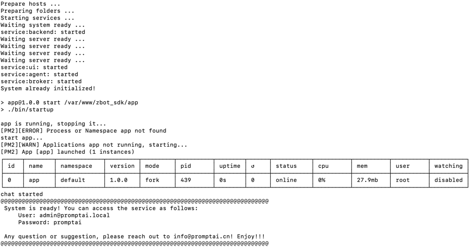
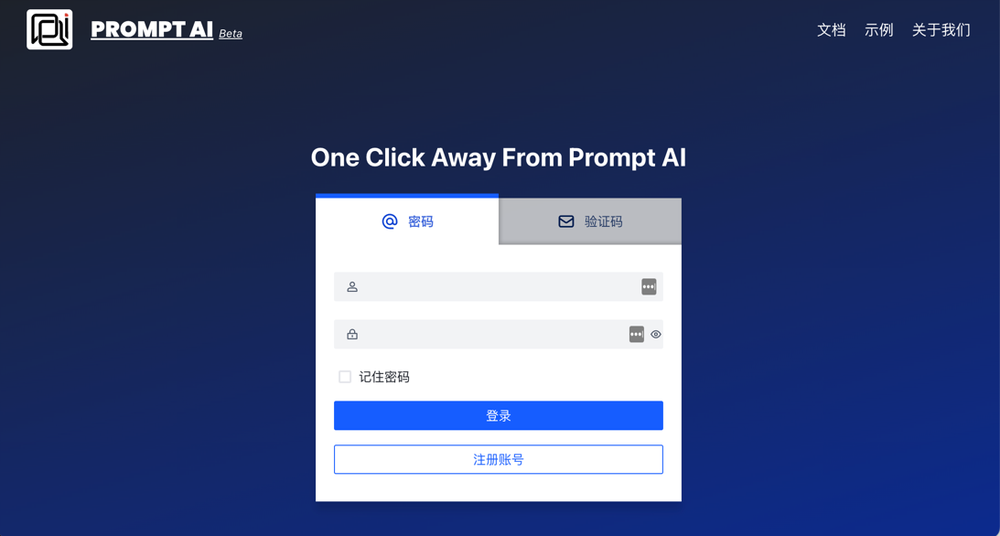

[中文](README.md) | [English](README_en.md)

<h2 align="center">什么是PromptAI？</h2>

鉴于RASA工程化经验， 我们去繁化简，贡献社区，全球独家发布基于RASA的脑图无代码编程工具， 无论您是否熟悉RASA, 都可极简实现对话系统， 在几分钟内完成一个对话设计， 并上线。 您也可免费下载生成的RASA文件， 私有部署。
<br/>
<h2 name="highlights" align="center">Highlights</h2>

<center>
<table>
  <tr>
    <th><h2>🆒</h2><h3>无代码编程</h3></th>
    <th><h2>🎓</h2><h3>全项目管理</h3></th>
    <th><h2>💻</h2><h3>开放预定义</h3></th>
    <th><h2>🚀</h2><h3>分模块快速调试</h3></th>
  </tr>
    <tr>
    <td width="25%">不管您是否理解<strong><a href="https://github.com/rasaHQ/rasa" target="_blank">Rasa</a></strong>， 都可快速上手。提供RASA 代码下载，方便进一步学习和掌握RASA</td>
    <td width="25%">实体， 意图， 槽位（变量），对话流图， 在同一个集成开发环境 （IDE) 中完整展示。可任意组合不同对话模块， 一键发布。首次将软件开发流程和对话系统设计/调试相结合。</td>
    <td width="25%">提供各种预定义实体， 意图，把能共享的都共享了，方便快速开发， 也欢迎大家提供共享模块， 联系我们。</td>
    <td width="25%">各分模可单独编译也可联合编译， 方便测试， 快速调试</td>
  </tr>

</table>
</center>

<br/>
<h2 name="features" align="center">特性</h2>
<table>

<tr>
    <td width="33%"><h4>可视化对话编辑器</h4></td>
    <td width="67%">立即设计和实现您的对话</Br>在我们基于直观对话的界面中创建自然的对话流。动态添加自然语言示例，使用按钮、图像和旋转木马创建丰富的响应。让工程师专注于系统和集成。</td>
</tr>
<tr>
    <td width="33%"><h4>会话表单</h4></td>
    <td width="67%">创建复杂的会话表单</Br>
无论您是想收集信息还是准备调用，我们的无代码流编辑器都允许您使用细粒度条件和用户输入验证实现复杂的业务逻辑。</td>
<tr>
    <td width="33%"><h4>定制</h4></td>
    <td width="67%">轻松完成编译和调试 </Br>我们提供不同方式的调试方案，以满足业务的不同需求。</td>
</tr>
<tr>
    <td width="33%"><h4>无侵入部署</h4></td>
    <td width="67%">一键便捷发布 </Br> 我们提供了 Web / Mobile方式进行发布，无需修改任何业务代码，在发布成功后自动生成引用代码。只需将数行代码拷贝到您的应用即可拥有对话能力。
</tr>
</table>
<br/>

<h2 name="quick-start" align="center">示例</h2>

### 视频
<table border="0">
<tr>
 <td width="33%">

[](https://www.promptai.cn)
 </td>
<td width="33%">

[](https://www.promptai.cn)
 </td>
<td width="33%">

[](https://www.promptai.cn)
 </td>
</tr>
</table>
<h2 name="quick-start" align="center">
扫码体验


</h2>

### 案例

[车载助手](/examples/car/car.md) 行车中常见的问答

<h2 name="quick-start" align="center">快速开始</h2>

云版本PromptAI可访问[https://app.promptai.cn](https://app.promptai.cn) 在注册账号后即可体验。


<h2 name="documentation" align="center">帮助文档</h2>

获取PromptAI[官方文档](https://doc.promptai.cn/) 可访问  [https://doc.promptai.cn](https://https://doc.promptai.cn). 

<h2 name="development" align="center">本地版安装</h2>

### 安装
如果你需要将服务部署到自己的私有服务器或者本地，可以参考如下教程。


#### 准备

1. 已安装最近版本的Docker
2. 足够的硬盘空间 (建议20GB以上，目前所需Docker镜像约为11GB)
3. Internet （如果不支持，可在有网络的机器导出Docker Image）

#### 脚本

安装过程可无人值守，这里pull image耗时与网络有关，可以喝杯茶再来。

1. 支持Linux/MacOS (如果你有Windows安装需求，可以在官网/微信群给我们留言)； 
2. 更新时重新执行该脚本即可，数据已挂载到本地目录；
3. 后期可能更新该脚本，敬请注意关注。
4. [shell 脚本](/scripts/install_zh.sh)

```shell
#!/bin/sh
zbot=registry.cn-hangzhou.aliyuncs.com/promptai/zbot-aio:latest
ai=registry.cn-hangzhou.aliyuncs.com/promptai/zbotai:release

# 1、pull docker image
docker pull $zbot
docker pull $ai

# 2、remove old container
docker rm -f zbot

# 3、prepare dirs
basedir=/usr/local/zbot/

mkdir -p $basedir/.promptai/
mkdir -p $basedir/logs
mkdir -p $basedir/mysql
mkdir -p $basedir/mongo
mkdir -p $basedir/p8s

# 4、bind port
hostport=9000

# 5、run container
# GPU version
# docker run --restart always --name zbot -d --add-host=host.docker.internal:host-gateway -v $basedir/.promptai/:$basedir/.promptai/:rw -v /var/run/docker.sock:/var/run/docker.sock  -v $basedir/logs:/data/logs -v $basedir/mysql:/data/mysql -v $basedir/mongo:/data/mongo -v $basedir/p8s:/data/minimalzp/p8s -e ai.base.dir=$basedir/.promptai/ -p $hostport:80 --gpus all $zbot
# CPU version
docker run --restart always --name zbot -d --add-host=host.docker.internal:host-gateway -v $basedir/.promptai/:$basedir/.promptai/:rw -v /var/run/docker.sock:/var/run/docker.sock  -v $basedir/logs:/data/logs -v $basedir/mysql:/data/mysql -v $basedir/mongo:/data/mongo -v $basedir/p8s:/data/minimalzp/p8s -e ai.base.dir=$basedir/.promptai/ -p $hostport:80  $zbot
```

#### 安装完成
命令执行完成后，我们可以看到地址、账号、密码信息，如图所示：

```shell
# 通过查看容器的日志，判断服务是否启动成功
docker logs -f zbot
```
看到`System is ready!`则表示系统启动成功


#### 登录体验
打开浏览器访问`http://ip:port`即可看到效果。*假设使用安装脚本且未更改端口，可访问`http://localhost:9000`进行登录*

使用安装完成后显示账号、密码即可开启体验，如图所示：


<br/>*备注：默认的初始登录账号/密码:admin@promptai.local/promptai，但是请以服务安装完成后的显示为准*

<br/>
<h2 align="center">联系我们</h2>

官网：
[www.promptai.cn](https://www.promptai.cn/)

邮箱：info@promptai.cn

<br/>
<h2 align="center">许可</h2>

免费使用