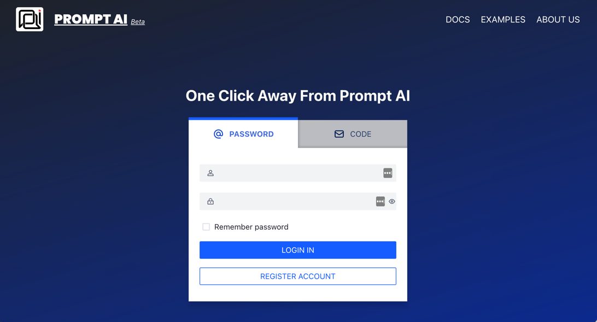

[中文](README.md) | [English](README_en.md)

<h2 align="center">PromptDialog： No-code User Interface for Dialogue Design and Conversational AI  </h2>

PromptDialog is a no-code user interface built for fast dialogue design and deployment.  It is based on <a href="https://github.com/rasaHQ/rasa" target="_blank">RASA</a>, but does not require specific knowledge of RASA to design and deploy chatbots. PromptDialog uses natural language to design natural language dialogues.  It minimizes annotation and coding efforts,  aiming for a chatbot release in a few minutes.  PromptDialog facilitates intelligent debugging, allowing your team to quickly identify errors and improve your design.  The source code of developed chatbots can be downloaded for local/cloud deployment and further customization. 

<br/>

<h2 name="highlights" align="center">Highlights</h2>

<center>
<table>
  <tr>
    <th><h3>No code programming</h3></th>
    <th><h3>Whole project management</h3></th>
    <th><h3>Open predefined</h3></th>
    <th><h3>Fast debugging of modules</h3></th>
  </tr>
    <tr>
    <td width="25%">You can design a dialogue system directly without knowing programming.  It provides generated <strong><a href="https://github.com/rasaHQ/rasa" target="_blank">RASA</a></strong> codes for further learning and customization.</td>
    <td width="25%">Entities, intents, slots (variables) and dialog flows are fully displayed in the same integrated development environment (IDE). Different dialogue modules can be combined at will and released with one click.  It is the first of its kind system that embeded software development process in dialogue system design/debugging.</td>
    <td width="25%">Provide various predefined entities and intents to facilitate rapid development. You are welcome to provide shared modules.</td>
    <td width="25%">Each dialogue flow can be compiled separately or jointly to facilitate testing and rapid debugging.</td>
  </tr>

</table>
</center>

<br/>
<h2 name="features" align="center">Features</h2>
<table>

<tr>
    <td width="33%"><h4>Visual Dialogue Editor</h4></td>
    <td width="67%"> Create a dialogue flow using an intuitive natural language interface. Add intent and entity examples, and create rich responses using buttons, images, and merry-go-rounds.  Deploy dialog bots in one click after the design is done. </td>
</tr>
<tr>
    <td width="33%"><h4>Complex Business Flows</h4></td>
    <td width="67%"> Our no-code flow editor allows you to implement complex information collection and/or business logics using fine-grained conditions and input validation.</td>
<tr>
    <td width="33%"><h4>Customization</h4></td>
    <td width="67%">Train and debug models easily.</br>We provide different debugging schemes to meet different business needs.</td>
</tr>
<tr>
    <td width="33%"><h4>Non-Intrusive Deployment</h4></td>
    <td width="67%">It provides Web/Mobile modes for publishing and automatically generates RASA code after publishing. Just copy a few lines of code to have the conversation capability in your applications.
</tr>
</table>
<br/>

<h2 name="quick-start" align="center">Examples</h2>

### Video
<table border="0">
<tr>
 <td width="33%">

[](https://www.promptai.cn/en/#examples)
 </td>
<td width="33%">

[](https://www.promptai.cn/en/#examples)
 </td>
<td width="33%">

[](https://www.promptai.cn/en/#examples)
 </td>
</tr>
</table>

### Cases

[Car](/examples/car/car_en.md) FAQs in driving

[Fruits](/examples/fruits/fruits.md) collect fruits order information

[Weather](/examples/weather/weather.md) query city weather

<h2 name="quick-start" align="center">Quick Start</h2>

Cloud version PromptAI is accessible[https://app.promptai.cn](https://app.promptai.cn) You can experience it after registering your account.


<h2 name="documentation" align="center">Documents</h2>

Get PromptAI Document [Document](https://doc.promptai.cn/) from [https://doc.promptai.cn](https://doc.promptai.cn). 

<h2 name="development" align="center">Local installation</h2>

### Install
If you need to deploy the service to your own private server or local, you can refer to the following tutorial.


#### Prepare

1. The latest version of Docker is installed
2. Enough hard disk space (more than 20GB is recommended, and the current Docker image required is about 11GB)
3. Internet (if not supported, you can export Docker Image on a machine with a network)

#### Script

The installation process can be unattended. The pull image time here is related to the network. You can have a cup of tea and come back.

1. Support Linux/MacOS (if you have Windows installation requirements, you can leave us a message on the official website/WeChat group); 
2. Re-execute the script when updating, and the data has been mounted to the local directory;
3. The script may be updated later. Please pay attention。
4. The [shell script](/scripts/install_en.sh)

```shell
#!/bin/sh
zbot=promptai/zbot-aio:latest
ai=promptai/zbotai:release

# 1、pull docker image
docker pull $zbot
docker pull $ai

docker rm -f zbot
# 2、prepare dirs
basedir=/usr/local/zbot/

mkdir -p $basedir/.promptai/
mkdir -p $basedir/logs
mkdir -p $basedir/mysql
mkdir -p $basedir/mongo
mkdir -p $basedir/p8s

# 3、bind port
hostport=9000

# GPU version
# docker run --restart always --name zbot -d --add-host=host.docker.internal:host-gateway -v $basedir/.promptai/:$basedir/.promptai/:rw -v /var/run/docker.sock:/var/run/docker.sock  -v $basedir/logs:/data/logs -v $basedir/mysql:/data/mysql -v $basedir/mongo:/data/mongo -v $basedir/p8s:/data/minimalzp/p8s -e ai.base.dir=$basedir/.promptai/ -p $hostport:80 --gpus all $zbot
# CPU version
docker run --restart always --name zbot -d --add-host=host.docker.internal:host-gateway -v $basedir/.promptai/:$basedir/.promptai/:rw -v /var/run/docker.sock:/var/run/docker.sock  -v $basedir/logs:/data/logs -v $basedir/mysql:/data/mysql -v $basedir/mongo:/data/mongo -v $basedir/p8s:/data/minimalzp/p8s -e ai.base.dir=$basedir/.promptai/ -p $hostport:80  $zbot
```

#### Completed
After the command is executed, we can see the address, account and password information, as shown in the figure:

```shell
# Judge whether the service is started successfully by viewing the container log
docker logs -f zbot
```
See ` System is ready` Indicates that the system is started successfully


#### Login experience
Open browser access` http://ip:port `You can see the effect *Assuming that the installation script is used and the port is not changed, you can access` http://localhost:9000 `Log in*

The user can start the experience by displaying the account and password after installation, as shown in the figure:


<br/>*Note: Default initial login account/password: admin@promptai.local /Promptai, but please follow the display after the service installation*

<br/>
<h2 align="center">Contact</h2>

Official Website：
[www.promptai.cn](https://www.promptai.cn/)

Email: info@promptai.cn

<br/>
<h2 align="center">Licence</h2>

Free use
