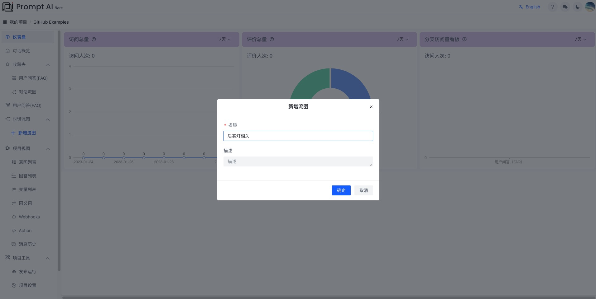
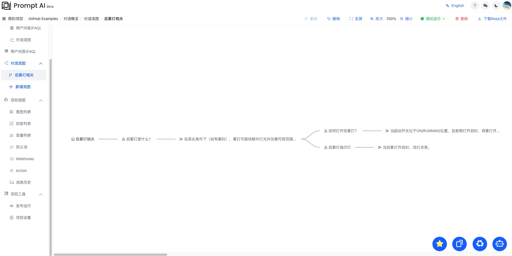
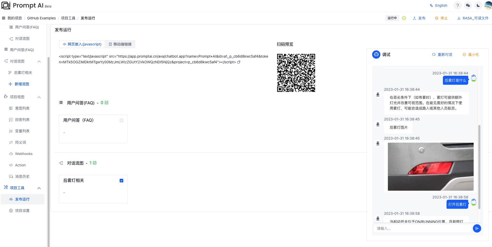
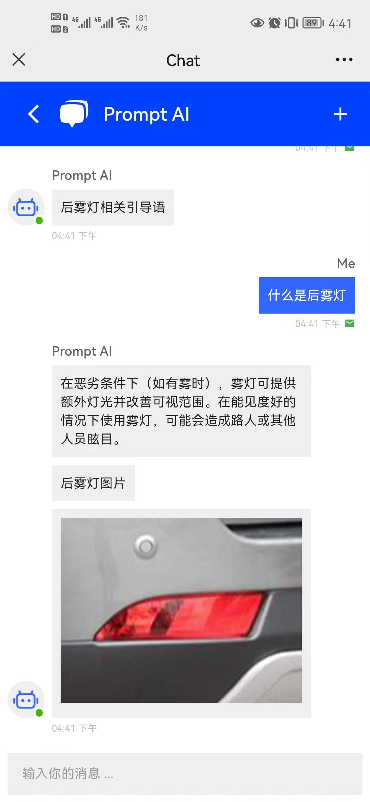

[中文](car.md) | [English](car_en.md)

## Car Assistant

Cars are common equipment tools in our lives, and there are many equipment machines in them. When we want to know the information of one of the devices, we can quickly build a car device assistant based on the capabilities provided by PromptAI.

### The following is the construction process

> 1. Click "Add Flow Diagram" to create a flow diagram named "Rear Fog Lamp Related", as shown in the figure:
>    

> 2. Select the "Rear Fog Lamp Related" node, and the menu shown in the figure will appear, as shown in the figure:
>    

> 3. After clicking the menu "User Input", enter the edit node, and complete the editing of the node according to the prompt information, as shown in the figure:
>    

> 4. We created some question and answer points about the knowledge points related to "rear fog lights" in turn, and successfully connected them, as shown in the figure:
>    

> 5. Click "Debug Run-Current Module" in the upper right corner, and after waiting for a while, you can try the dialogue, as shown in the figure:
>    

> 6. Click "Release Run" on the right menu to enter the release deployment page, as shown in the figure:
>    

> 7. Click "Publish" in the upper right corner, and after waiting for a while, you can chat, deploy scripts, and preview online.
>    

> 8. Scan the QR code and preview online
>    

### Successfully completed the build

So far, we have successfully completed a small assistant robot for car equipment, please share it!
