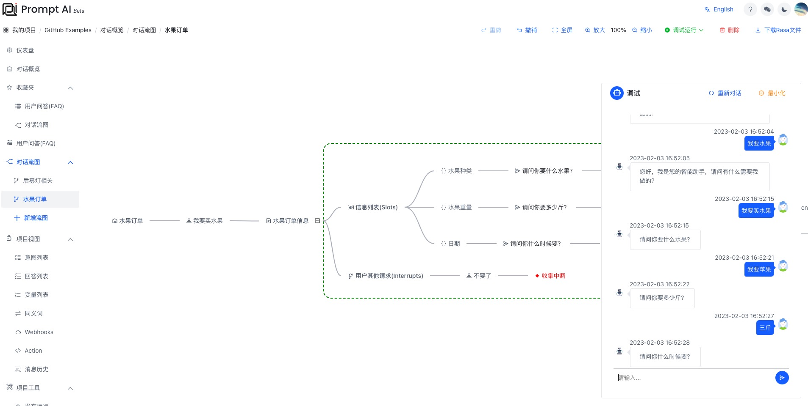
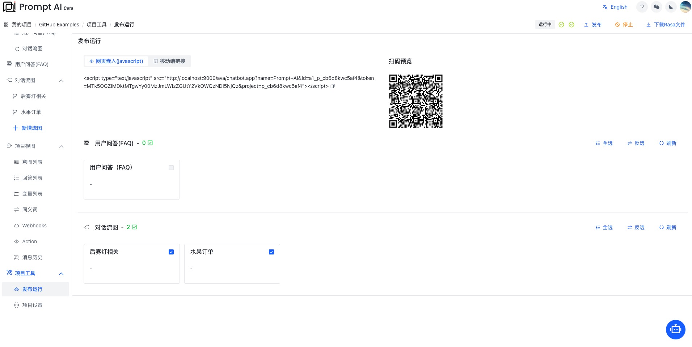
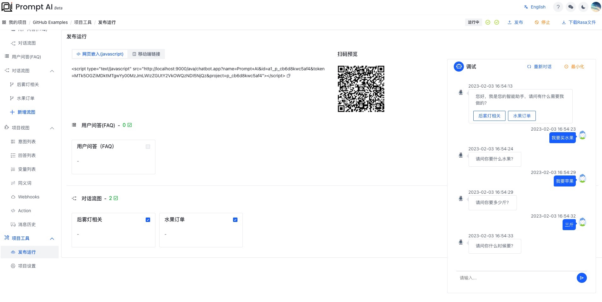

[中文](fruits.md) | [English](fruits_en.md)

## 水果订单小助手

我们作为一个小小的水果店铺，每天都有线上订单。我们通常需要询问客户需要什么水果，需要多少水果，什么时间送达等一些列问题。这时候，我们可以基于 PromptAI 的能力，快速创建一个订单小助手来帮助我们快速收集这些信息。

### 以下是搭建过程

> 1. 点击“新增流图”，创建名为“水果订单”的流图，如图所示：
>    

> 2. 选中“水果订单”节点，出现如图所示菜单，如图所示：
>    

> 3. 点击菜单“用户输入”后，进入编辑节点，按提示信息完成节点的编辑，如图所示：
>    

> 4. 点击“我要买水果”节点，出现如图所示菜单，如图所示：
>    

> 5. 点击“信息收集”后，创建“水果订单信息”，如图所示：
>    

> 6. 点击“信息列表”节点后，如图所示：
>    
>    我们开始创建第一个信息收集项：**什么水果** .
>    
>    创建一个**变量**“水果种类”来存储“什么水果”
>    
>    然后，我们创建了一个“你要什么水果？”的反问，这时我们需要从用户输入中提取“水果种类”了。创建一个“用户输入”：
>    
>    同理，，我们依次创建：**多少水果**、**送达时间**等信息收集项。
>    

> 7. 我们依次补全信息收集，如图所示：
>    

> 8. 点击右上角“调试运行-当前模块”，等待一段时间后，即可尝试对话，如图所示：
>    

> 9. 点击右边住菜单“发布运行”，进入发布部署页面，如图所示：
>    

> 10. 点击右上角“发布”，等待一段时间后，即可对话、部署脚本、在线预览。
>     

> 11. 扫描二维码，在线预览
>     

### 成功完成搭建

至此，我们成功的完成了一个小小的水果订单的助手机器人，快快分享吧！
