[中文](fruits.md) | [English](fruits_en.md)

## Fruit order assistant

As a small fruit store, we have online orders every day. We usually need to ask customers what fruit they need, how much fruit they need, and when to deliver it. At this time, we can quickly create an order assistant based on the ability of PromptAI to help us quickly collect this information.

### The following is the construction process

> 1. Click "Add Flow Chart" to create a flow chart named "Fruit Order", as shown in the figure:
>    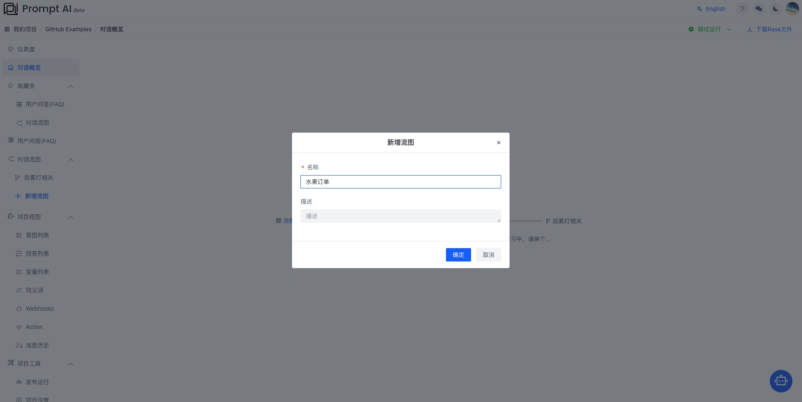

> 2. Select the "fruit order" node, and the menu as shown in the figure will appear, as shown in the figure:
>    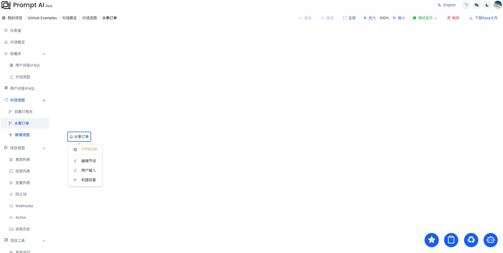

> 3. Click the menu "User Input", enter the editing node, and complete the editing of the node according to the prompt information, as shown in the figure:
>    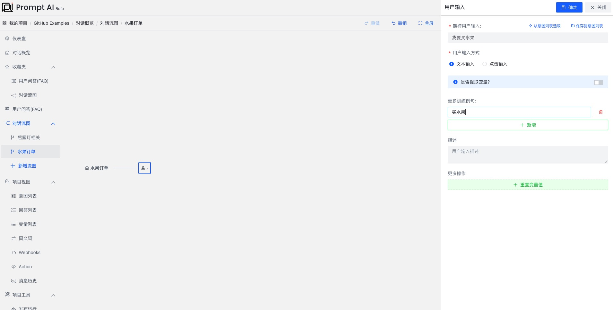

> 4. Click the "I want to buy fruit" node, and the menu as shown in the figure will appear, as shown in the figure:
>    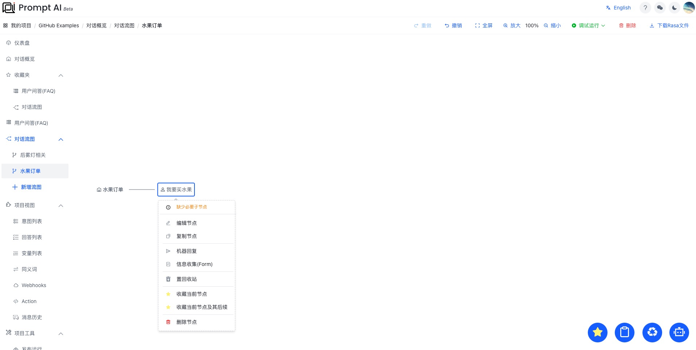

> 5. Click "information collection" to create "fruit order information", as shown in the figure:
>    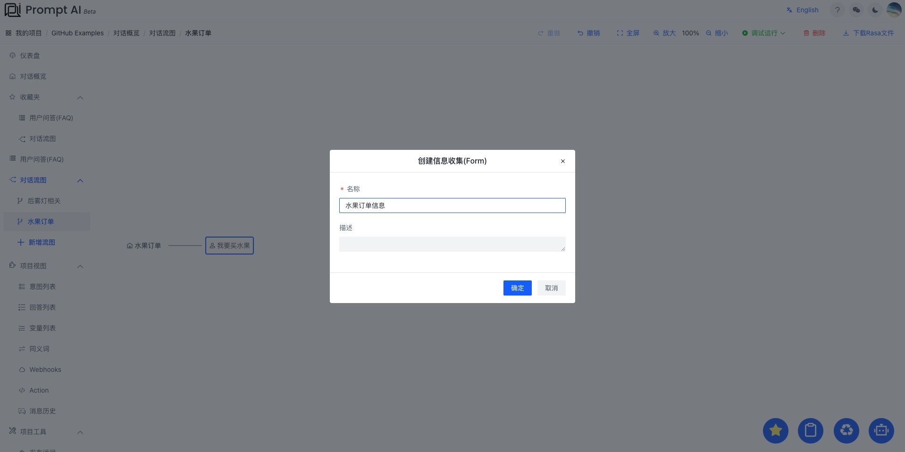

> 6. Click the "Information List" node, as shown in the figure:
>    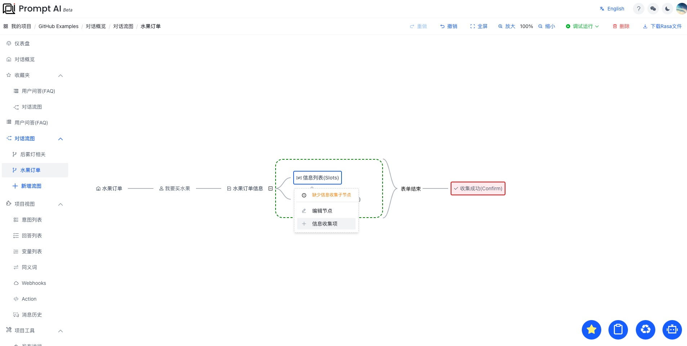
>    We started to create the first information collection item: **What fruit**
>    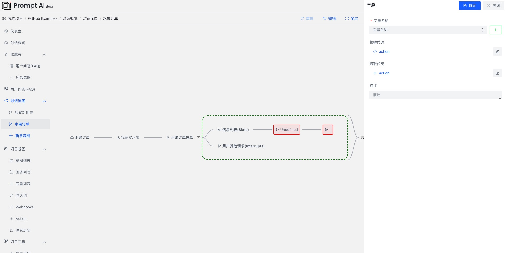
>    Create a **variable** "fruit type" to store "what fruit"
>    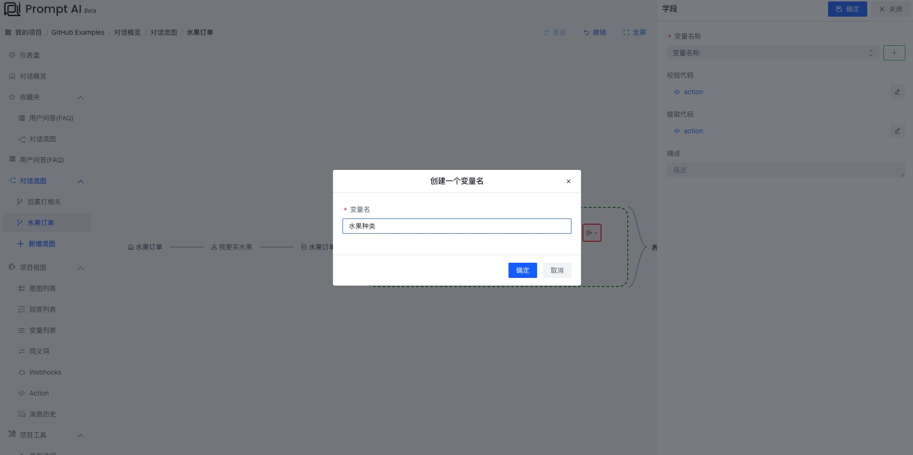
>    Then, we created a rhetorical question of "What fruit do you want?". At this time, we need to extract the "fruit type" from the user input. Create a User Input:
>    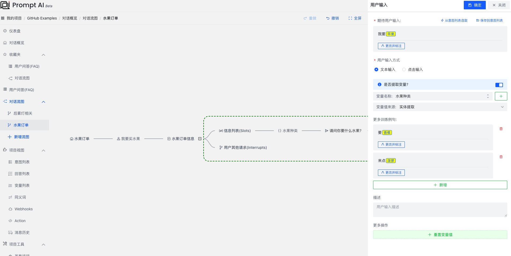
>    In the same way, we successively create: **How many fruits**, **Delivery time** and other information collection items.
>    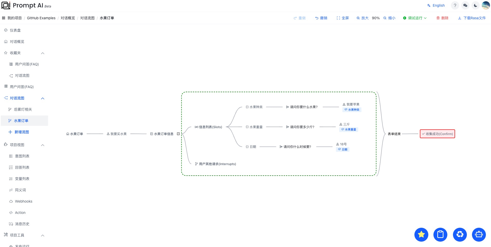

> 7. We complete the information collection in turn, as shown in the figure:
>    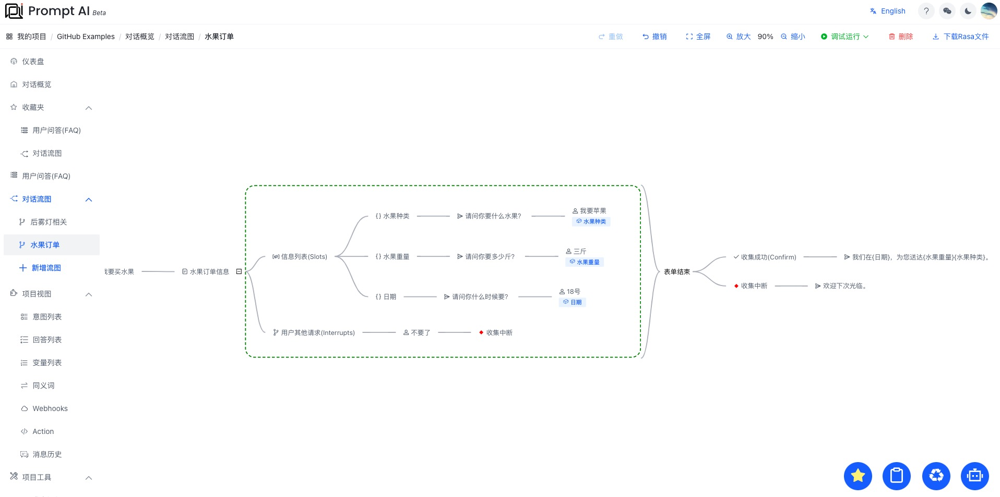

> 8. Click "Debug Run - Current Module" in the upper right corner, wait for a period of time, and then try to talk, as shown in the figure:
>    

> 9. Click the "Publish Run" menu on the right to enter the publish deployment page, as shown in the figure:
>    

> 10. Click "Publish" in the upper right corner and wait for a period of time before you can talk, deploy scripts and preview online.
>     

> 11. Scan QR code and preview online
>     

### Successfully completed the construction

So far, we have successfully completed a small fruit order assistant robot, share it quickly!
