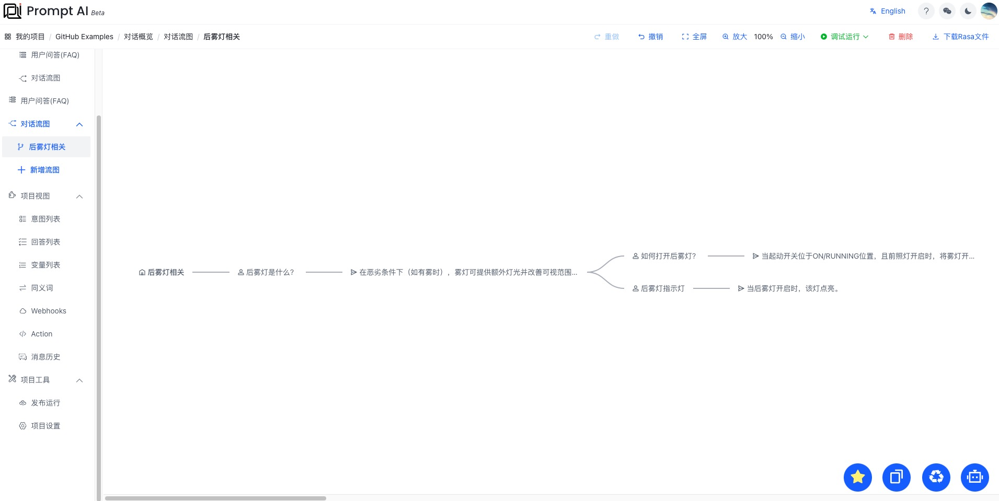

[中文](saic_example.md) | [English](saic_example_en.md)

## 汽车小助手

汽车作为我们生活中常见的设备工具，其中的设备机器有很多很多。当我们想了解其中某个设备的信息的时候，我们可以基于 PromptAI 提供的能力，快速搭建一个汽车设备小助手。

### 以下是搭建过程

> 1. 点击“新增流图”，创建名为“后雾灯相关”的流图，如图所示：
>    

> 2. 选中“后雾灯相关”节点，出现如图所示菜单，如图所示：
>    

> 3. 点击菜单“用户输入”后，进入编辑节点，按提示信息完成节点的编辑，如图所示：
>    

> 4. 我们依次创建了一些关于“后雾灯”相关的知识点问答点，并成功连接，如图所示：
>    

> 5. 点击右上角“调试运行-当前模块”，等待一段时间后，即可尝试对话，如图所示：
>    

> 6. 点击右边住菜单“发布运行”，进入发布部署页面，如图所示：
>    

> 7. 点击右上角“发布”，等待一段时间后，即可对话、部署脚本、在线预览。
>    

> 8. 扫描二维码，在线预览
>    

### 成功完成搭建

至此，我们成功的完成了一个小小的汽车设备的助手机器人，快快分享吧！
