[中文](weather.md) | [English](weather_en.md)

## 天气查询小助手

我们每天出行前，都希望知道今天天气情况？这时候，我们可以基于 PromptAI 的能力，快速创建一个天气查询小助手来帮助我们查询天气。

### 以下是搭建过程

> 1. 点击“新增流图”，创建名为“天气查询”的流图，如图所示：
>    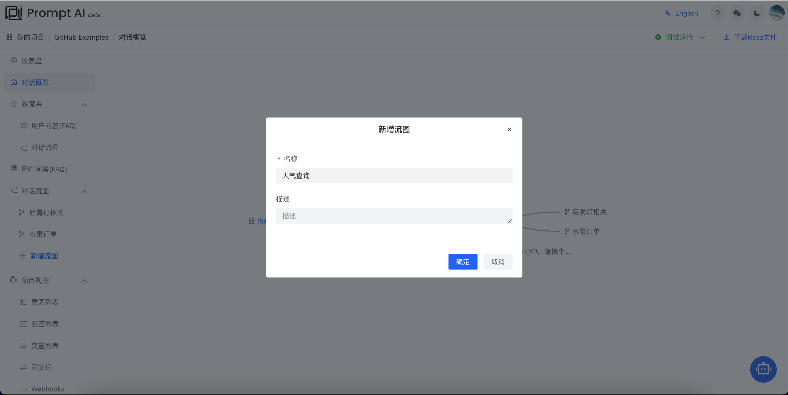

> 2. 选中“天气查询”节点，出现如图所示菜单，如图所示：
>    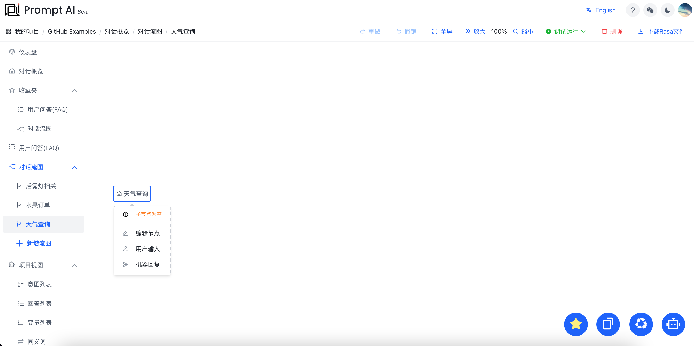

> 3. 点击菜单“用户输入”后，进入编辑节点，如图所示：
>    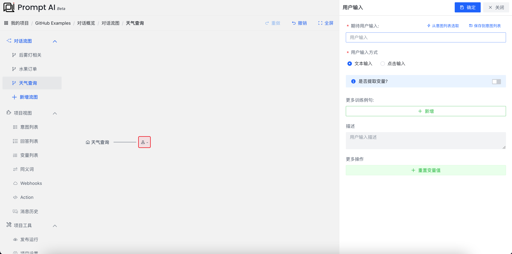
>    创建一个**变量**“city”来存储要查询天气的城市
     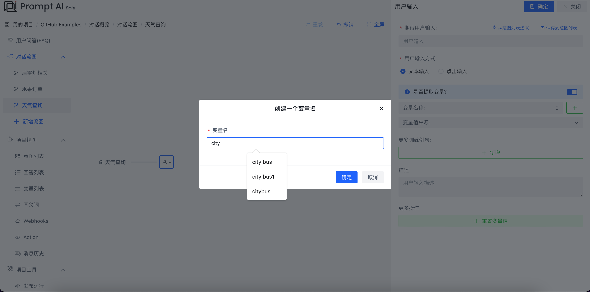
>    标记训练例句中的城市
     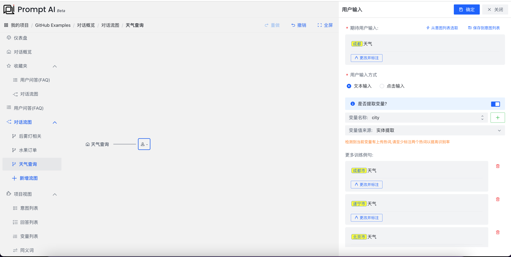
> 4. 点击“项目视图”->"Webhooks"，新增`Webhook`，如图所示：
>    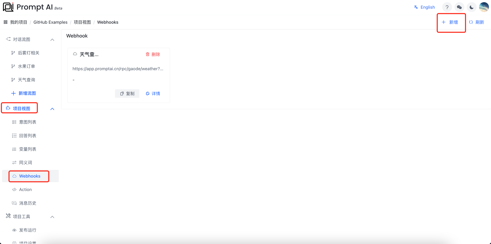
>    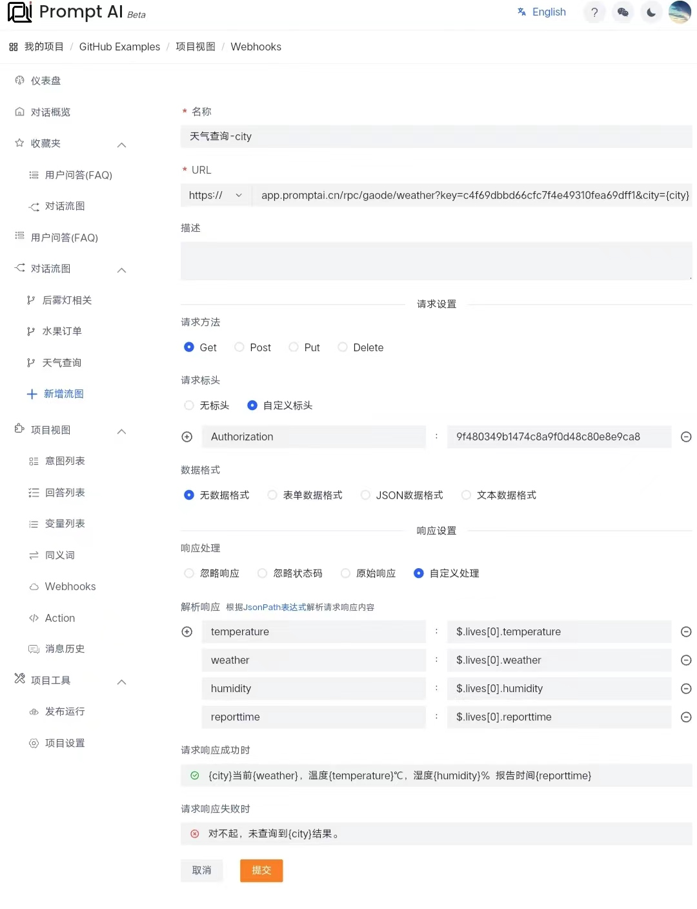
> 5. 点击“项目视图”->"变量列表"，给变量`city`添加城市相关热词，如图所示：
>    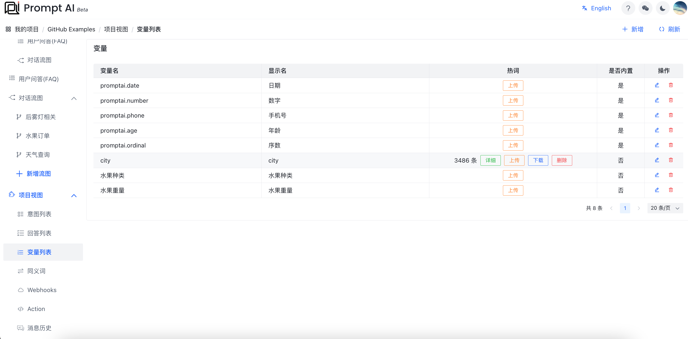

> 6. 点击右上角“调试运行-当前模块”，等待一段时间后，即可尝试对话，如图所示：
>    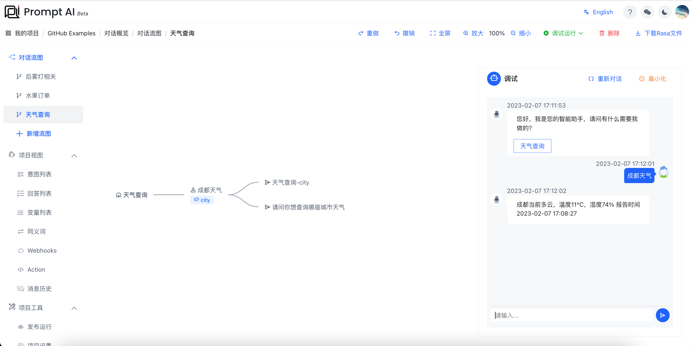

> 7. 点击右边住菜单“发布运行”，进入发布部署页面，如图所示：
>    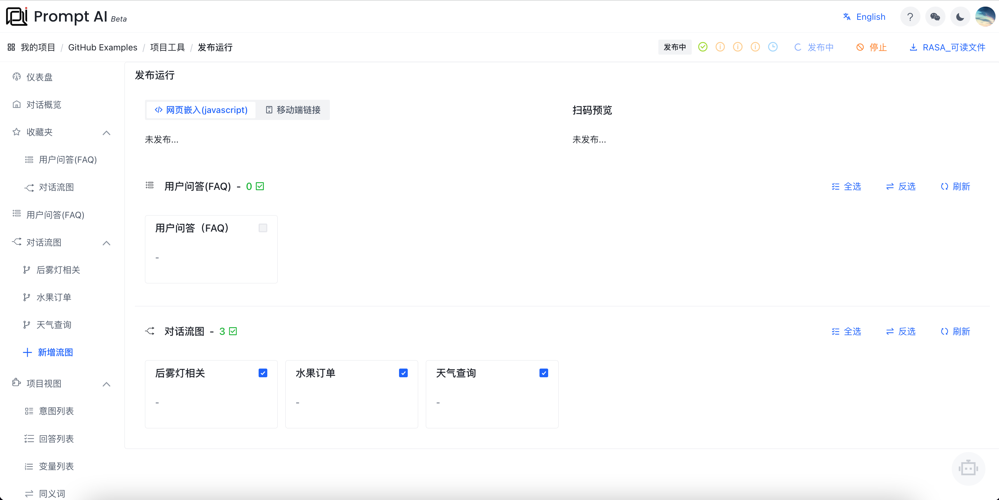

> 8. 点击右上角“发布”，等待一段时间后，即可对话、部署脚本、在线预览。
>    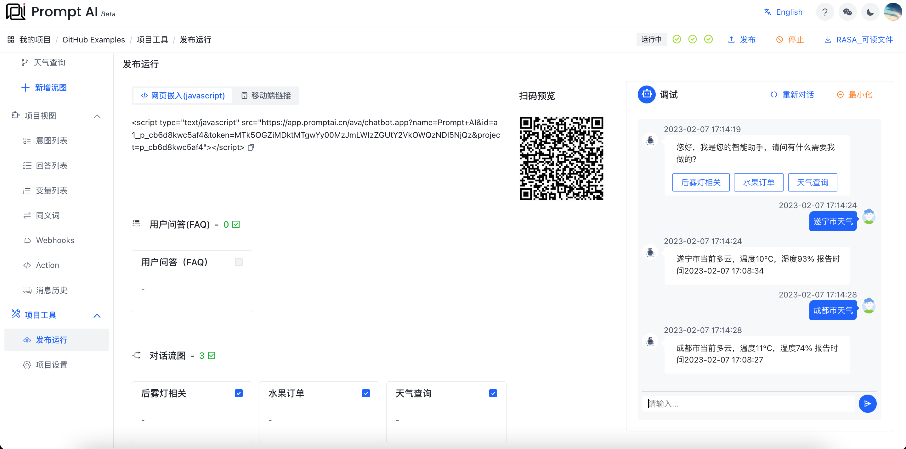

> 9. 扫描二维码，在线预览
>    

### 成功完成搭建

至此，我们成功的完成了一个天气查询的助手机器人，快快分享吧！
